# photo shader

通过链式的方式，对同一张纹理，做多次shader操作。

## 实现的功能

- BRIGHT,

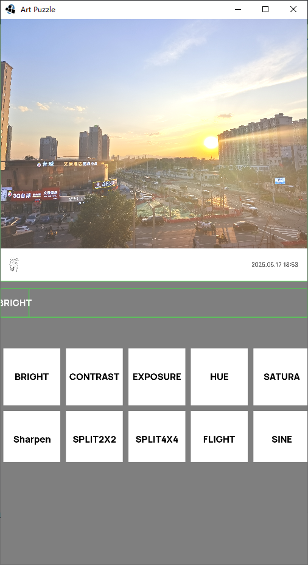

- CONTRAST,

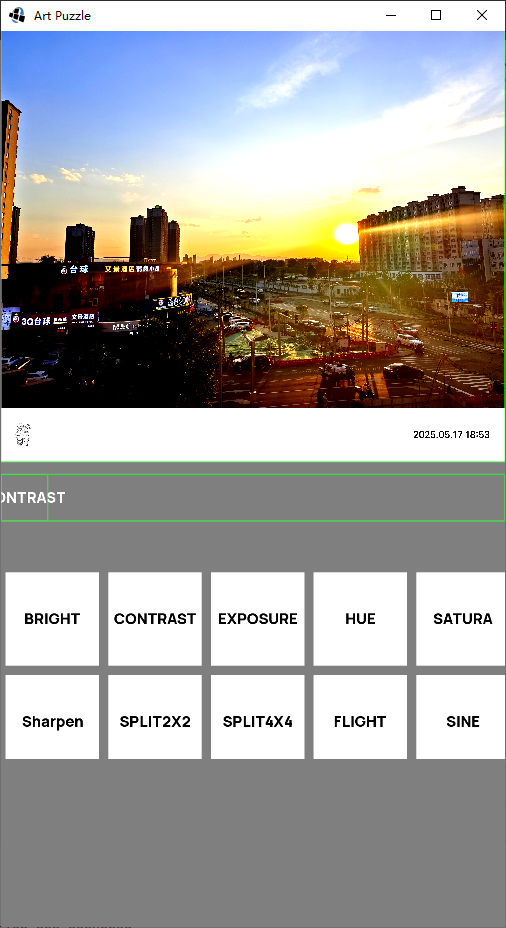

- EXPOSURE,

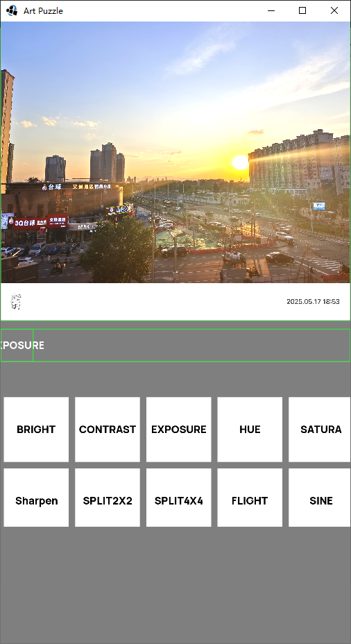
- HUE,

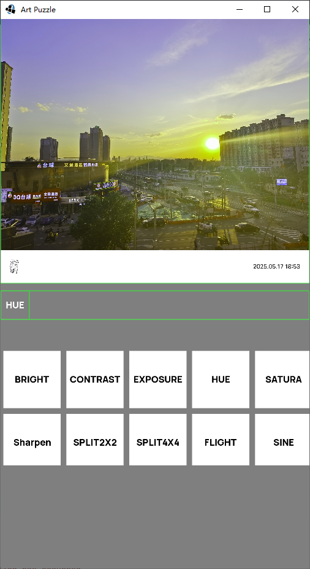
- SATURA,

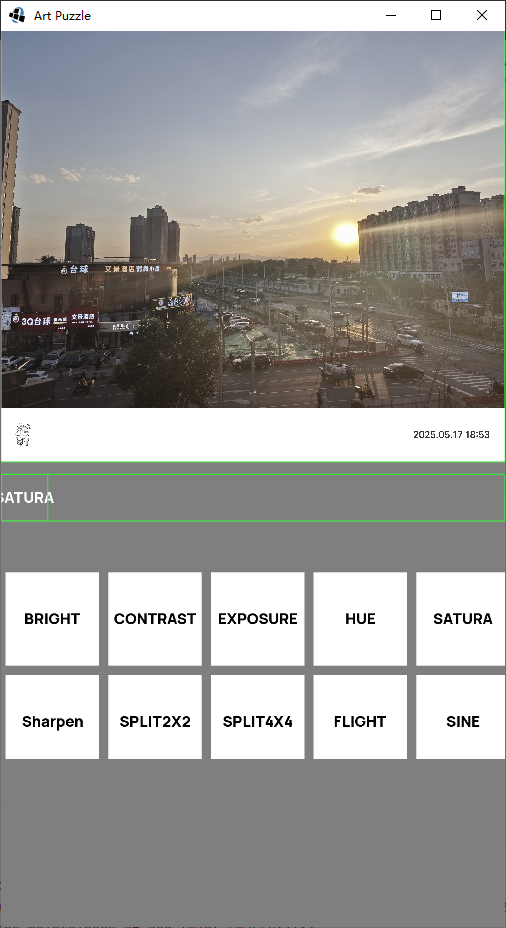
- n split

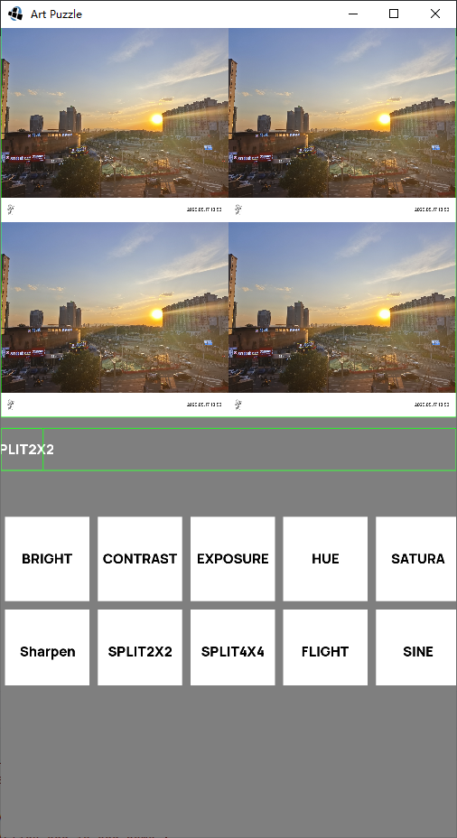
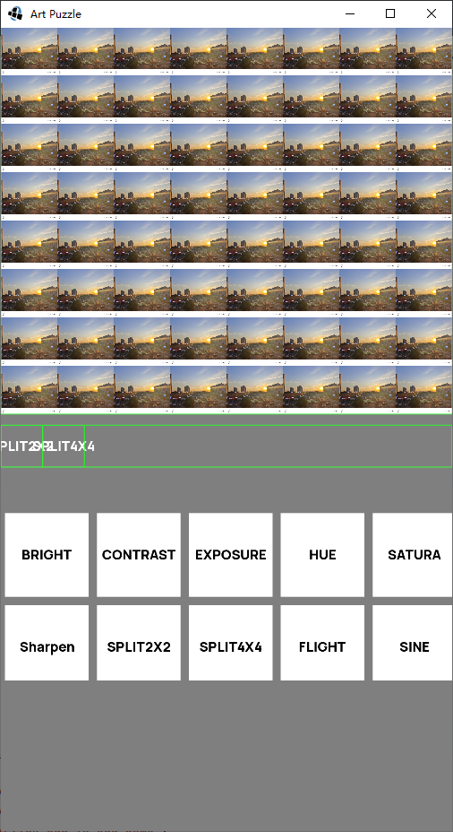
- Sharpen

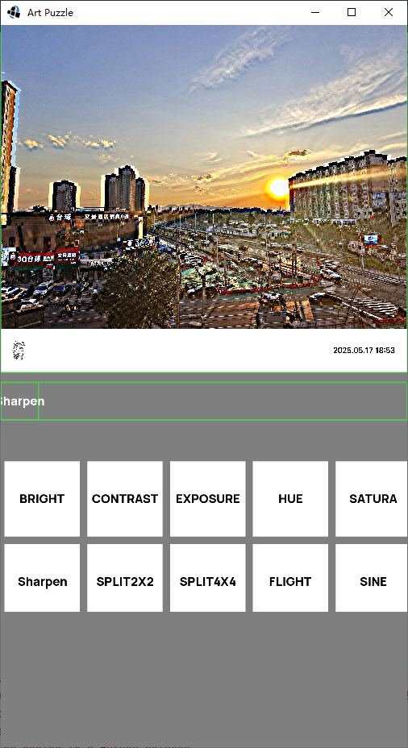
- FLIGHT

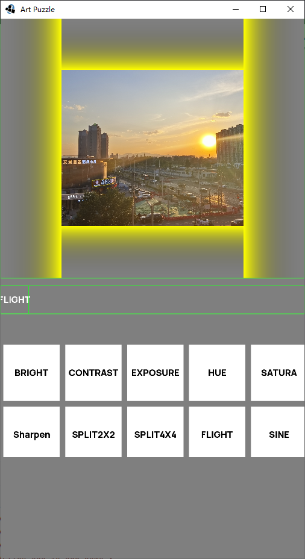
- SINE

- Blur 【很卡  没意思】

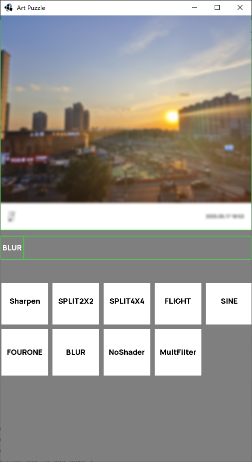
- Mult  【想的是多个图片操作  比如混合，切换等】

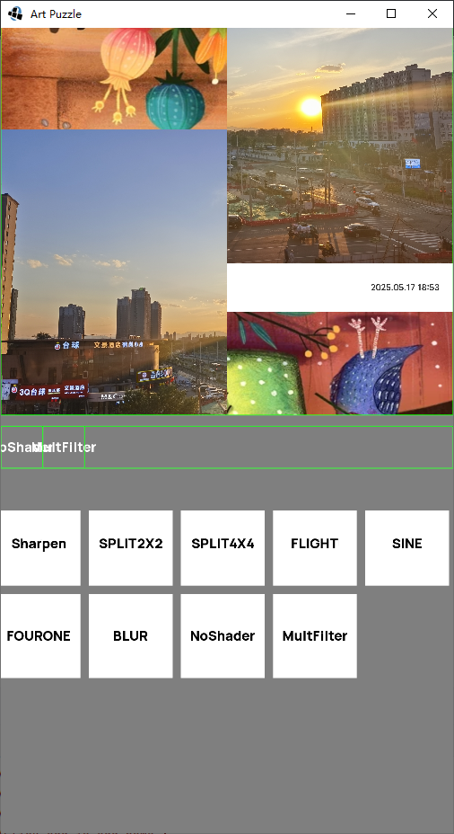