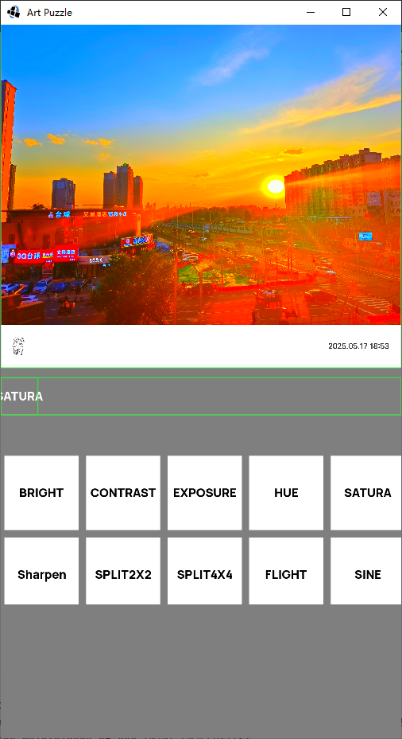

# photo shader

通过链式的方式，对同一张纹理，做多次shader操作。

## 实现的功能

- BRIGHT,

- CONTRAST,

- EXPOSURE,

- HUE,

- SATURA,

- n split

- Sharpen

- FLIGHT

- SINE

- Blur 【很卡  没意思】

- Mult  【想的是多个图片操作  比如混合，切换等】

